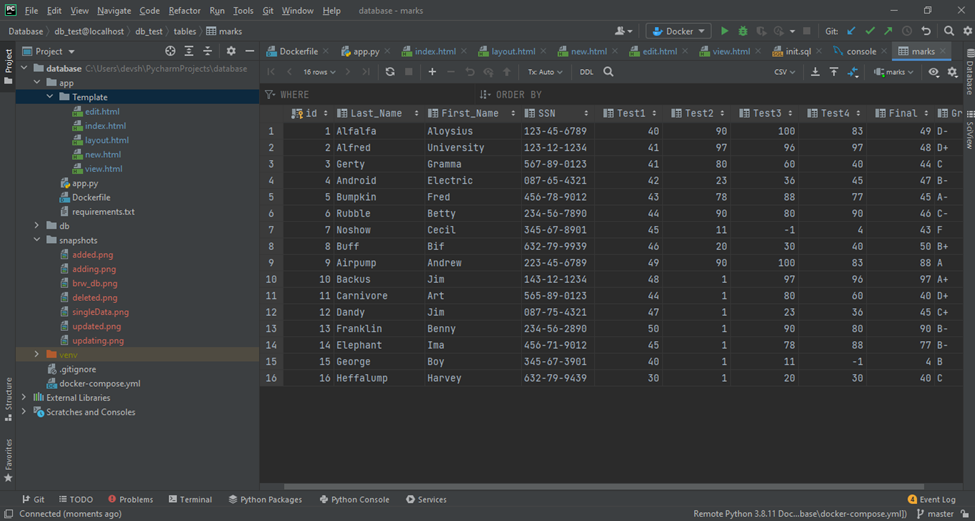
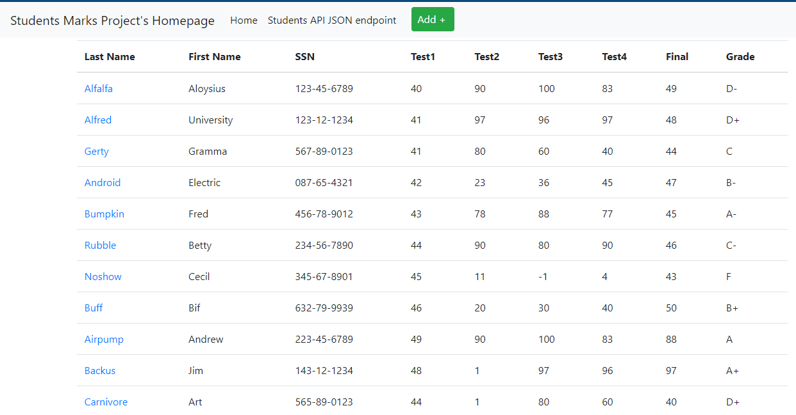
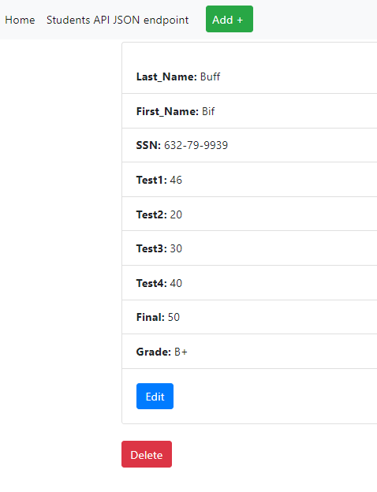
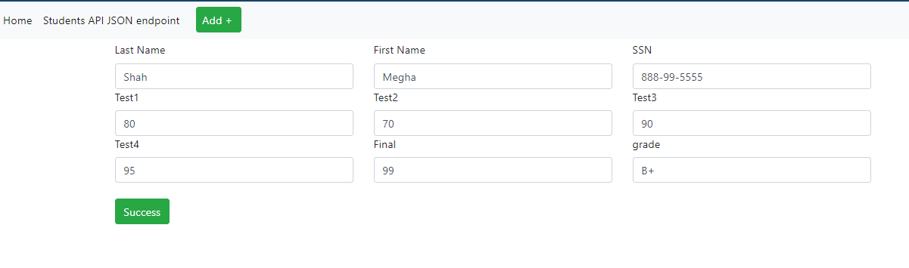
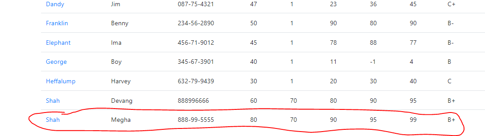
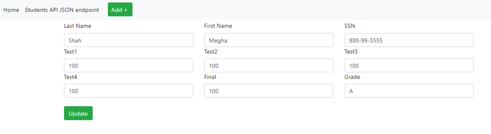
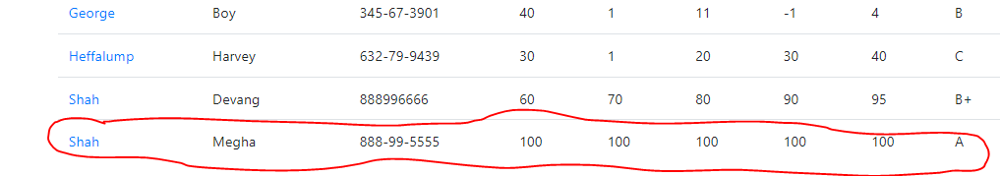
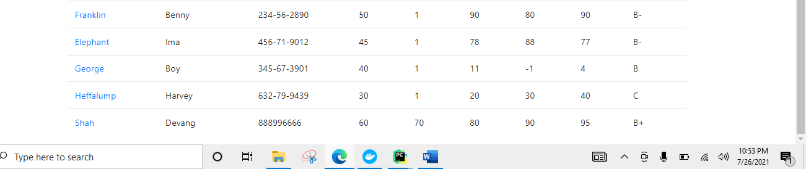

# Project Description
This project is a homework assignment to teach how to get Pycharm setup with Docker, Flask, MySQL, and Postman.
Added database and operations (Add new data, edit data & delete data)

# PyCharmDB Screenshot

# Browser DB Screenshot

# Single Data Screenshot

# Adding new Data Screenshot

# Added new Data Screenshot

# Updating Data Screenshot

# Updated Data Screenshot

# Deleted Data Screenshot

# Word Document

# Readings
* [What is an HTTP API?](https://www.smashingmagazine.com/2018/01/understanding-using-rest-api/)
* [What is JSON?](https://www.w3schools.com/whatis/whatis_json.asp)
* [What is SQL?](http://www.sqlcourse.com/intro.html)
* [What is MySQL](https://www.hostinger.com/tutorials/what-is-mysql)
* [What is Docker Compose?](https://www.tutorialspoint.com/docker/docker_compose.htm)
* [What is Flask?](https://en.wikipedia.org/wiki/Flask_(web_framework))
# Useful Links
* [Flask Homepage and Documentation](https://flask.palletsprojects.com/en/1.1.x/)
* [JSON Spec Reference](https://www.json.org/json-en.html)
* [SimpleJSON Reference](https://simplejson.readthedocs.io/en/latest/)
* [W3 Schools SQL Tutorial and Reference](https://www.w3schools.com/sql/)
